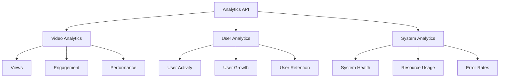

# Analytics API Reference

The Analytics API provides endpoints for accessing video and user analytics data, including views, engagement, and performance metrics.

## Analytics Overview



## Video Analytics

### Get Video Analytics

Get analytics for a specific video:

```http
GET /analytics/videos/{id}?period=7d&metrics=views,engagement,performance
```

Query Parameters:

| Parameter | Type | Description |
|-----------|------|-------------|
| `period` | string | Time period (1d, 7d, 30d, all) |
| `metrics` | string[] | Metrics to include |
| `groupBy` | string | Group by (hour, day, week) |
| `compare` | string | Compare with previous period |

Response:

```json
{
  "success": true,
  "data": {
    "period": {
      "start": "2024-03-24T00:00:00Z",
      "end": "2024-03-31T00:00:00Z",
      "previous": {
        "start": "2024-03-17T00:00:00Z",
        "end": "2024-03-24T00:00:00Z"
      }
    },
    "views": {
      "total": 10000,
      "unique": 8000,
      "change": 0.15,
      "byCountry": {
        "US": 5000,
        "UK": 2000,
        "DE": 1000
      },
      "byDevice": {
        "desktop": 6000,
        "mobile": 4000
      },
      "byPlatform": {
        "web": 7000,
        "ios": 2000,
        "android": 1000
      },
      "timeline": [
        {
          "date": "2024-03-24",
          "views": 1000,
          "unique": 800
        }
      ]
    },
    "engagement": {
      "averageWatchTime": 120,
      "completionRate": 0.75,
      "likes": 500,
      "comments": 100,
      "shares": 50,
      "timeline": [
        {
          "date": "2024-03-24",
          "watchTime": 120000,
          "completionRate": 0.75
        }
      ]
    },
    "performance": {
      "bufferingRate": 0.02,
      "averageBitrate": "2500k",
      "errorRate": 0.001,
      "timeline": [
        {
          "date": "2024-03-24",
          "bufferingRate": 0.02,
          "errorRate": 0.001
        }
      ]
    }
  }
}
```

### Get Video Analytics Summary

Get summary analytics for multiple videos:

```http
GET /analytics/videos/summary?period=30d
```

Response:

```json
{
  "success": true,
  "data": {
    "totalVideos": 50,
    "totalViews": 100000,
    "totalWatchTime": 12000000,
    "averageEngagement": {
      "watchTime": 120,
      "completionRate": 0.75,
      "likes": 500,
      "comments": 100
    },
    "topVideos": [
      {
        "id": "vid_123456",
        "title": "Top Video",
        "views": 10000,
        "watchTime": 1200000,
        "engagement": 0.8
      }
    ],
    "trends": {
      "views": 0.15,
      "watchTime": 0.2,
      "engagement": 0.1
    }
  }
}
```

## User Analytics

### Get User Analytics

Get analytics for user activity:

```http
GET /analytics/users?period=30d&metrics=activity,growth,retention
```

Response:

```json
{
  "success": true,
  "data": {
    "activity": {
      "activeUsers": {
        "daily": 1000,
        "weekly": 5000,
        "monthly": 20000
      },
      "sessions": {
        "total": 50000,
        "averageDuration": 600,
        "byDevice": {
          "desktop": 30000,
          "mobile": 20000
        }
      },
      "actions": {
        "uploads": 100,
        "comments": 500,
        "likes": 2000,
        "shares": 300
      }
    },
    "growth": {
      "newUsers": 5000,
      "returningUsers": 15000,
      "churnRate": 0.1,
      "bySource": {
        "organic": 3000,
        "referral": 1000,
        "social": 1000
      }
    },
    "retention": {
      "day1": 0.6,
      "day7": 0.4,
      "day30": 0.2,
      "cohorts": [
        {
          "date": "2024-03-01",
          "day1": 0.6,
          "day7": 0.4,
          "day30": 0.2
        }
      ]
    }
  }
}
```

### Get User Engagement

Get detailed user engagement metrics:

```http
GET /analytics/users/engagement?period=7d
```

Response:

```json
{
  "success": true,
  "data": {
    "engagement": {
      "averageSessionDuration": 600,
      "pagesPerSession": 5,
      "bounceRate": 0.3,
      "byUserType": {
        "new": {
          "sessionDuration": 400,
          "pagesPerSession": 3
        },
        "returning": {
          "sessionDuration": 800,
          "pagesPerSession": 7
        }
      },
      "byTimeOfDay": [
        {
          "hour": 14,
          "users": 1000,
          "engagement": 0.8
        }
      ]
    }
  }
}
```

## System Analytics

### Get System Health

Get system health metrics:

```http
GET /analytics/system/health?period=24h
```

Response:

```json
{
  "success": true,
  "data": {
    "uptime": 0.9999,
    "responseTime": {
      "average": 100,
      "p95": 200,
      "p99": 300
    },
    "errors": {
      "rate": 0.001,
      "byType": {
        "api": 0.0005,
        "processing": 0.0003,
        "storage": 0.0002
      }
    },
    "resources": {
      "cpu": {
        "usage": 0.6,
        "load": [1.2, 1.5, 1.8]
      },
      "memory": {
        "usage": 0.7,
        "available": "4GB"
      },
      "storage": {
        "usage": 0.8,
        "available": "100GB"
      }
    }
  }
}
```

### Get Performance Metrics

Get detailed performance metrics:

```http
GET /analytics/system/performance?period=1h
```

Response:

```json
{
  "success": true,
  "data": {
    "api": {
      "requests": {
        "total": 100000,
        "perSecond": 28,
        "byEndpoint": {
          "/videos": 50000,
          "/users": 30000,
          "/analytics": 20000
        }
      },
      "responseTime": {
        "average": 100,
        "byEndpoint": {
          "/videos": 80,
          "/users": 120,
          "/analytics": 150
        }
      }
    },
    "processing": {
      "videos": {
        "queued": 10,
        "processing": 5,
        "averageTime": 300
      },
      "thumbnails": {
        "queued": 20,
        "processing": 8,
        "averageTime": 30
      }
    },
    "storage": {
      "operations": {
        "reads": 50000,
        "writes": 10000,
        "errors": 5
      },
      "bandwidth": {
        "in": "100MB/s",
        "out": "500MB/s"
      }
    }
  }
}
```

## Export Analytics

### Export Data

Export analytics data:

```http
POST /analytics/export
Content-Type: application/json

{
  "type": "video",
  "period": "30d",
  "metrics": ["views", "engagement"],
  "format": "csv"
}
```

Response:

```json
{
  "success": true,
  "data": {
    "exportId": "exp_123456",
    "status": "processing",
    "downloadUrl": "https://exports.videocloud.com/exp_123456.csv",
    "expiresAt": "2024-04-01T12:00:00Z"
  }
}
```

### Get Export Status

Check export status:

```http
GET /analytics/export/{id}
```

## Error Handling

Common analytics API errors:

| Code | Description |
|------|-------------|
| `ANALYTICS_INVALID_PERIOD` | Invalid time period |
| `ANALYTICS_INVALID_METRICS` | Invalid metrics requested |
| `ANALYTICS_DATA_UNAVAILABLE` | Data not available for period |
| `ANALYTICS_EXPORT_FAILED` | Export generation failed |
| `ANALYTICS_RATE_LIMIT` | Too many requests |

## SDK Examples

### JavaScript/TypeScript

```typescript
import { VideoCloud } from '@videocloud/sdk';

const client = new VideoCloud({
  apiKey: 'your_api_key'
});

// Get video analytics
const getVideoAnalytics = async () => {
  const analytics = await client.analytics.getVideo('vid_123456', {
    period: '7d',
    metrics: ['views', 'engagement']
  });
  console.log(analytics.views.total);
};

// Get user analytics
const getUserAnalytics = async () => {
  const analytics = await client.analytics.getUsers({
    period: '30d',
    metrics: ['activity', 'growth']
  });
  console.log(analytics.activity.activeUsers.daily);
};

// Export analytics
const exportAnalytics = async () => {
  const export = await client.analytics.export({
    type: 'video',
    period: '30d',
    format: 'csv'
  });
  console.log(export.downloadUrl);
};
```

### Python

```python
from videocloud import VideoCloud

client = VideoCloud(api_key='your_api_key')

# Get video analytics
analytics = client.analytics.get_video('vid_123456',
    period='7d',
    metrics=['views', 'engagement']
)
print(analytics.views.total)

# Get user analytics
analytics = client.analytics.get_users(
    period='30d',
    metrics=['activity', 'growth']
)
print(analytics.activity.active_users.daily)

# Export analytics
export = client.analytics.export(
    type='video',
    period='30d',
    format='csv'
)
print(export.download_url)
```

## Related Documentation

- [API Overview](./overview)
- [Video API](./video-api)
- [User API](./user-api)
<!-- - [SDK Documentation](../sdk/overview) --> 