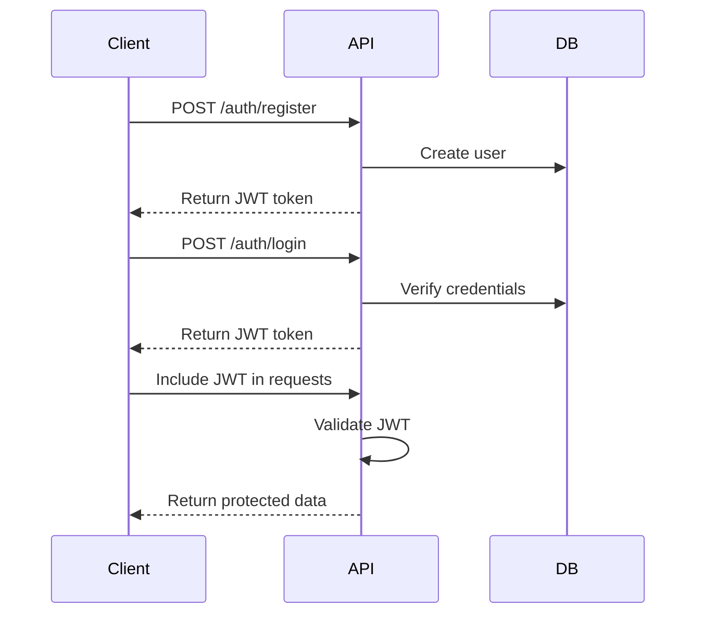

# Authentication Guide

This guide covers all aspects of authentication in the VideoCloud API, including user registration, login, token management, and security best practices.

## Authentication Flow



## Registration

Register a new user account:

```http
POST /auth/register
Content-Type: application/json

{
  "email": "user@example.com",
  "password": "secure_password",
  "username": "username",
  "firstName": "John",
  "lastName": "Doe"
}
```

Response:

```json
{
  "success": true,
  "data": {
    "token": "eyJhbGciOiJIUzI1NiIs...",
    "user": {
      "id": "usr_123456",
      "email": "user@example.com",
      "username": "username",
      "firstName": "John",
      "lastName": "Doe",
      "createdAt": "2024-03-31T12:00:00Z"
    }
  }
}
```

### Registration Requirements

- Email must be unique and valid
- Password must be at least 8 characters
- Username must be 3-30 characters
- Username can only contain letters, numbers, and underscores

## Login

Authenticate and get a JWT token:

```http
POST /auth/login
Content-Type: application/json

{
  "email": "user@example.com",
  "password": "secure_password"
}
```

Response:

```json
{
  "success": true,
  "data": {
    "token": "eyJhbGciOiJIUzI1NiIs...",
    "user": {
      "id": "usr_123456",
      "email": "user@example.com",
      "username": "username",
      "firstName": "John",
      "lastName": "Doe"
    }
  }
}
```

## Token Management

### Token Structure

JWT tokens contain the following claims:

```json
{
  "sub": "usr_123456",
  "email": "user@example.com",
  "role": "user",
  "iat": 1617235200,
  "exp": 1617321600,
  "jti": "jwt_123456"
}
```

### Token Refresh

Refresh an expired token:

```http
POST /auth/refresh
Authorization: Bearer <expired_token>
```

Response:

```json
{
  "success": true,
  "data": {
    "token": "eyJhbGciOiJIUzI1NiIs...",
    "expiresIn": 86400
  }
}
```

### Token Invalidation

Logout and invalidate the current token:

```http
POST /auth/logout
Authorization: Bearer <current_token>
```

## Password Management

### Forgot Password

Request a password reset:

```http
POST /auth/forgot-password
Content-Type: application/json

{
  "email": "user@example.com"
}
```

### Reset Password

Reset password using the token from email:

```http
POST /auth/reset-password
Content-Type: application/json

{
  "token": "reset_token_from_email",
  "password": "new_secure_password"
}
```

## OAuth Integration

VideoCloud supports OAuth 2.0 authentication with popular providers:

### Google OAuth

```http
GET /auth/google
```

### GitHub OAuth

```http
GET /auth/github
```

### Microsoft OAuth

```http
GET /auth/microsoft
```

## Security Best Practices

### 1. Token Security

- Store tokens securely (e.g., HTTP-only cookies)
   - Never expose tokens in client-side code
- Implement token refresh before expiration
- Use short-lived tokens (default: 1 hour)

### 2. Password Security

- Use strong passwords (minimum 8 characters)
   - Implement password complexity requirements
- Hash passwords using bcrypt
- Enable two-factor authentication

### 3. API Security

- Always use HTTPS
- Implement rate limiting
- Validate all input data
- Use secure headers

### 4. Session Management

- Implement proper session timeout
- Clear sessions on logout
- Monitor for suspicious activity
- Implement account lockout

## Error Handling

Common authentication errors:

```json
{
  "success": false,
  "error": {
    "code": "AUTH_INVALID_CREDENTIALS",
    "message": "Invalid email or password"
  }
}
```

Error codes:

| Code | Description |
|------|-------------|
| `AUTH_INVALID_CREDENTIALS` | Invalid email or password |
| `AUTH_TOKEN_EXPIRED` | JWT token has expired |
| `AUTH_TOKEN_INVALID` | Invalid JWT token |
| `AUTH_EMAIL_EXISTS` | Email already registered |
| `AUTH_USERNAME_EXISTS` | Username already taken |
| `AUTH_PASSWORD_WEAK` | Password too weak |
| `AUTH_ACCOUNT_LOCKED` | Account temporarily locked |
| `AUTH_2FA_REQUIRED` | Two-factor authentication required |

## SDK Examples

### JavaScript/TypeScript

```typescript
import { VideoCloud } from '@videocloud/sdk';

const client = new VideoCloud({
  apiKey: 'your_api_key'
});

// Register
const register = async () => {
  const response = await client.auth.register({
  email: 'user@example.com',
    password: 'secure_password',
    username: 'username'
});
  console.log(response.token);
};

// Login
const login = async () => {
  const response = await client.auth.login({
  email: 'user@example.com',
    password: 'secure_password'
});
  console.log(response.token);
};
```

### Python

```python
from videocloud import VideoCloud

client = VideoCloud(api_key='your_api_key')

# Register
response = client.auth.register(
    email='user@example.com',
    password='secure_password',
    username='username'
)
print(response.token)

# Login
response = client.auth.login(
    email='user@example.com',
    password='secure_password'
)
print(response.token)
```

## Next Steps

- [API Overview](/docs/api/api-overview)
- [Video API](/docs/api/video-api)
- [User API](/docs/api/user-api)
- [Security Guide](/docs/security/security-guide)

## Related Documentation

- [API Overview](./overview)
- [Security Guide](../security/overview)
- [User Management](./user-api)
<!-- - [SDK Documentation](../sdk/overview) --> 