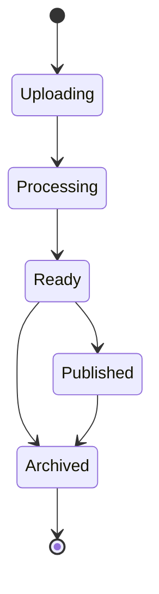

# Video API Reference

The Video API provides endpoints for managing video content, including upload, processing, streaming, and analytics.

## Video Lifecycle



## Video Management

### List Videos

Get a paginated list of videos:

```http
GET /videos?page=1&limit=10&sort=createdAt&order=desc
```

Query Parameters:

| Parameter | Type | Description |
|-----------|------|-------------|
| `page` | number | Page number (default: 1) |
| `limit` | number | Items per page (default: 10, max: 100) |
| `sort` | string | Sort field (createdAt, title, views) |
| `order` | string | Sort order (asc, desc) |
| `status` | string | Filter by status (processing, ready, published) |
| `search` | string | Search in title and description |

Response:

```json
{
  "success": true,
  "data": {
    "items": [
      {
        "id": "vid_123456",
        "title": "My Video",
        "description": "Video description",
        "status": "published",
        "duration": 120,
        "thumbnailUrl": "https://thumb.videocloud.com/v/123456",
        "views": 1000,
        "createdAt": "2024-03-31T12:00:00Z",
        "publishedAt": "2024-03-31T12:05:00Z"
      }
    ],
    "total": 100,
    "page": 1,
    "limit": 10,
    "pages": 10
  }
}
```

### Get Video

Get detailed information about a specific video:

```http
GET /videos/{id}
```

Response:

```json
{
  "success": true,
  "data": {
    "id": "vid_123456",
    "title": "My Video",
    "description": "Video description",
    "status": "published",
    "duration": 120,
    "thumbnailUrl": "https://thumb.videocloud.com/v/123456",
    "streamUrl": "https://stream.videocloud.com/v/123456",
    "downloadUrl": "https://download.videocloud.com/v/123456",
    "views": 1000,
    "likes": 100,
    "comments": 50,
    "tags": ["tutorial", "how-to"],
    "visibility": "public",
    "createdAt": "2024-03-31T12:00:00Z",
    "publishedAt": "2024-03-31T12:05:00Z",
    "metadata": {
      "width": 1920,
      "height": 1080,
      "format": "mp4",
      "codec": "h264",
      "bitrate": "5000k",
      "fps": 30
    }
  }
}
```

### Upload Video

Upload a new video:

```http
POST /videos
Content-Type: multipart/form-data

file: <video_file>
title: My Video
description: Video description
visibility: public
tags: tutorial,how-to
```

Response:

```json
{
  "success": true,
  "data": {
    "id": "vid_123456",
    "uploadUrl": "https://upload.videocloud.com/v/123456",
    "status": "uploading",
    "createdAt": "2024-03-31T12:00:00Z"
  }
}
```

### Update Video

Update video details:

```http
PUT /videos/{id}
Content-Type: application/json

{
  "title": "Updated Title",
  "description": "Updated description",
  "visibility": "private",
  "tags": ["updated", "tags"]
}
```

### Delete Video

Delete a video:

```http
DELETE /videos/{id}
```

## Video Processing

### Processing Status

Get video processing status:

```http
GET /videos/{id}/status
```

Response:

```json
{
  "success": true,
  "data": {
    "status": "processing",
    "progress": 75,
    "currentStep": "transcoding",
    "estimatedTimeRemaining": 300,
    "steps": [
      {
        "name": "upload",
        "status": "completed",
        "completedAt": "2024-03-31T12:01:00Z"
      },
      {
        "name": "transcoding",
        "status": "in_progress",
        "progress": 75,
        "startedAt": "2024-03-31T12:01:00Z"
      },
      {
        "name": "thumbnail",
        "status": "pending"
      }
    ]
  }
}
```

### Processing Options

Configure processing options during upload:

```http
POST /videos
Content-Type: multipart/form-data

file: <video_file>
title: My Video
processing: {
  "quality": "high",
  "formats": ["mp4", "webm"],
  "resolutions": [1080, 720, 480],
  "generateThumbnail": true,
  "watermark": {
    "enabled": true,
    "position": "bottom-right",
    "image": <watermark_file>
  }
}
```

## Video Streaming

### Get Stream URL

Get video streaming URL:

```http
GET /videos/{id}/stream
```

Response:

```json
{
  "success": true,
  "data": {
    "url": "https://stream.videocloud.com/v/123456",
    "expiresAt": "2024-03-31T13:00:00Z",
    "formats": [
      {
        "quality": "1080p",
        "url": "https://stream.videocloud.com/v/123456/1080p",
        "mimeType": "video/mp4",
        "bitrate": "5000k"
      },
      {
        "quality": "720p",
        "url": "https://stream.videocloud.com/v/123456/720p",
        "mimeType": "video/mp4",
        "bitrate": "2500k"
      }
    ],
    "hlsUrl": "https://stream.videocloud.com/v/123456/master.m3u8",
    "dashUrl": "https://stream.videocloud.com/v/123456/manifest.mpd"
  }
}
```

### Player Embed

Get embed code for the video player:

```http
GET /videos/{id}/embed
```

Response:

```json
{
  "success": true,
  "data": {
    "html": "<iframe src='https://player.videocloud.com/v/123456'...",
    "url": "https://player.videocloud.com/v/123456",
    "options": {
      "autoplay": false,
      "controls": true,
      "loop": false,
      "muted": false
    }
  }
}
```

## Video Analytics

### Get Video Analytics

Get video analytics data:

```http
GET /videos/{id}/analytics?period=7d
```

Query Parameters:

| Parameter | Type | Description |
|-----------|------|-------------|
| `period` | string | Time period (1d, 7d, 30d, all) |
| `metrics` | string[] | Metrics to include |
| `groupBy` | string | Group by (hour, day, week) |

Response:

```json
{
  "success": true,
  "data": {
    "views": {
      "total": 10000,
      "unique": 8000,
      "byCountry": {
        "US": 5000,
        "UK": 2000
      },
      "byDevice": {
        "desktop": 6000,
        "mobile": 4000
      },
      "timeline": [
        {
          "date": "2024-03-25",
          "views": 1000
        }
      ]
    },
    "engagement": {
      "averageWatchTime": 120,
      "completionRate": 0.75,
      "likes": 500,
      "comments": 100
    }
  }
}
```

## Video Comments

### List Comments

Get video comments:

```http
GET /videos/{id}/comments?page=1&limit=20
```

### Add Comment

Add a comment to a video:

```http
POST /videos/{id}/comments
Content-Type: application/json

{
  "content": "Great video!",
  "parentId": "com_123456" // Optional, for replies
}
```

### Update Comment

Update a comment:

```http
PUT /comments/{id}
Content-Type: application/json

{
  "content": "Updated comment"
}
```

### Delete Comment

Delete a comment:

```http
DELETE /comments/{id}
```

## Error Handling

Common video API errors:

| Code | Description |
|------|-------------|
| `VIDEO_NOT_FOUND` | Video not found |
| `VIDEO_ACCESS_DENIED` | Insufficient permissions |
| `VIDEO_PROCESSING_FAILED` | Video processing failed |
| `VIDEO_UPLOAD_FAILED` | Video upload failed |
| `VIDEO_INVALID_FORMAT` | Invalid video format |
| `VIDEO_SIZE_LIMIT` | Video size exceeds limit |
| `VIDEO_DURATION_LIMIT` | Video duration exceeds limit |

## SDK Examples

### JavaScript/TypeScript

```typescript
import { VideoCloud } from '@videocloud/sdk';

const client = new VideoCloud({
  apiKey: 'your_api_key'
});

// Upload video
const uploadVideo = async () => {
  const response = await client.videos.upload({
    file: videoFile,
    title: 'My Video',
    description: 'Video description',
    visibility: 'public'
  });
  console.log(response.id);
};

// Get video
const getVideo = async (id) => {
  const video = await client.videos.get(id);
  console.log(video.title);
};

// Get stream URL
const getStreamUrl = async (id) => {
  const stream = await client.videos.getStreamUrl(id);
  console.log(stream.url);
};
```

### Python

```python
from videocloud import VideoCloud

client = VideoCloud(api_key='your_api_key')

# Upload video
response = client.videos.upload(
    file='video.mp4',
    title='My Video',
    description='Video description',
    visibility='public'
)
print(response.id)

# Get video
video = client.videos.get('vid_123456')
print(video.title)

# Get stream URL
stream = client.videos.get_stream_url('vid_123456')
print(stream.url)
```

## Related Documentation

- [API Overview](./overview)
- [Authentication Guide](./authentication)
- [Analytics API](./analytics-api)
- [SDK Documentation](../sdk/overview) 