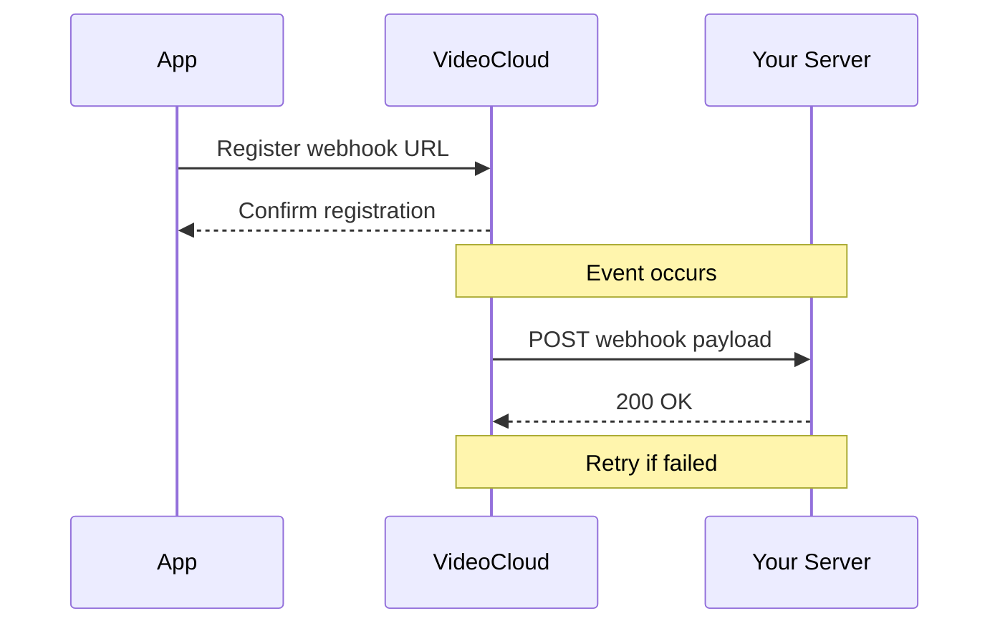

# Webhooks Guide

Webhooks allow you to receive real-time notifications about events in your VideoCloud account. This guide explains how to set up and use webhooks.

## Webhook Overview



## Setting Up Webhooks

### Register Webhook

Register a webhook endpoint:

```http
POST /webhooks
Content-Type: application/json

{
  "url": "https://your-server.com/webhooks",
  "events": [
    "video.uploaded",
    "video.processed",
    "video.published"
  ],
  "secret": "your_webhook_secret"
}
```

Response:

```json
{
  "success": true,
  "data": {
    "id": "whk_123456",
    "url": "https://your-server.com/webhooks",
    "events": [
      "video.uploaded",
      "video.processed",
      "video.published"
    ],
    "status": "active",
    "createdAt": "2024-03-31T12:00:00Z"
  }
}
```

### List Webhooks

Get all registered webhooks:

```http
GET /webhooks
```

Response:

```json
{
  "success": true,
  "data": {
    "items": [
      {
        "id": "whk_123456",
        "url": "https://your-server.com/webhooks",
        "events": [
          "video.uploaded",
          "video.processed",
          "video.published"
        ],
        "status": "active",
        "createdAt": "2024-03-31T12:00:00Z",
        "lastDelivery": {
          "success": true,
          "timestamp": "2024-03-31T12:05:00Z"
        }
      }
    ]
  }
}
```

### Update Webhook

Update webhook configuration:

```http
PUT /webhooks/{id}
Content-Type: application/json

{
  "events": [
    "video.uploaded",
    "video.processed",
    "video.published",
    "video.deleted"
  ],
  "secret": "new_webhook_secret"
}
```

### Delete Webhook

Delete a webhook:

```http
DELETE /webhooks/{id}
```

## Event Types

VideoCloud webhooks support the following event types:

### Video Events
- `video.uploaded` - Triggered when a new video is uploaded
- `video.processed` - Triggered when video processing is complete
- `video.published` - Triggered when a video is published
- `video.updated` - Triggered when video metadata is updated
- `video.deleted` - Triggered when a video is deleted

### User Events
- `user.created` - Triggered when a new user is created
- `user.updated` - Triggered when user profile is updated
- `user.deleted` - Triggered when a user is deleted

### Engagement Events
- `engagement.view` - Triggered when a video is viewed
- `engagement.like` - Triggered when a video is liked
- `engagement.comment` - Triggered when a comment is posted

### System Events
- `system.error` - Triggered when a system error occurs
- `system.warning` - Triggered when a system warning occurs

## Webhook Payloads

### Video Uploaded

```json
{
  "event": "video.uploaded",
  "timestamp": "2024-03-31T12:00:00Z",
  "data": {
    "videoId": "vid_123456",
    "title": "My Video",
    "size": 10485760,
    "duration": 120,
    "format": "mp4",
    "userId": "usr_123456",
    "status": "processing"
  }
}
```

### Video Processed

```json
{
  "event": "video.processed",
  "timestamp": "2024-03-31T12:05:00Z",
  "data": {
    "videoId": "vid_123456",
    "status": "ready",
    "formats": [
      {
        "quality": "1080p",
        "url": "https://stream.videocloud.com/v/123456/1080p",
        "size": 52428800
      },
      {
        "quality": "720p",
        "url": "https://stream.videocloud.com/v/123456/720p",
        "size": 26214400
      }
    ],
    "thumbnailUrl": "https://thumb.videocloud.com/v/123456",
    "processingTime": 300
  }
}
```

### User Registered

```json
{
  "event": "user.registered",
  "timestamp": "2024-03-31T12:00:00Z",
  "data": {
    "userId": "usr_123456",
    "email": "user@example.com",
    "username": "username",
    "firstName": "John",
    "lastName": "Doe",
    "registrationMethod": "email"
  }
}
```

### Comment Created

```json
{
  "event": "comment.created",
  "timestamp": "2024-03-31T12:00:00Z",
  "data": {
    "commentId": "com_123456",
    "videoId": "vid_123456",
    "userId": "usr_123456",
    "content": "Great video!",
    "parentId": null,
    "createdAt": "2024-03-31T12:00:00Z"
  }
}
```

## Security

### Webhook Signatures

Each webhook request includes a signature in the `X-VideoCloud-Signature` header. Verify the signature to ensure the request is from VideoCloud:

```javascript
const crypto = require('crypto');

function verifyWebhookSignature(payload, signature, secret) {
  const hmac = crypto.createHmac('sha256', secret);
  const calculatedSignature = hmac.update(payload).digest('hex');
  return crypto.timingSafeEqual(
    Buffer.from(signature),
    Buffer.from(calculatedSignature)
  );
}
```

### IP Whitelist

You can whitelist VideoCloud's IP addresses to ensure requests only come from our servers:

```
52.1.2.3
52.1.2.4
52.1.2.5
```

## Best Practices

### 1. Endpoint Setup

- Use HTTPS for your webhook endpoint
- Implement proper authentication
- Handle requests asynchronously
- Return 200 OK quickly
- Implement idempotency

### 2. Error Handling

- Log all webhook requests
- Implement retry logic
- Monitor webhook failures
- Set up alerts for issues

### 3. Security

- Verify webhook signatures
- Use IP whitelisting
- Keep webhook secrets secure
- Monitor for suspicious activity

### 4. Performance

- Process webhooks asynchronously
- Implement request queuing
- Monitor endpoint performance
- Scale your webhook handler

## Retry Policy

If your webhook endpoint fails to respond or returns an error, VideoCloud will retry the delivery with exponential backoff:

| Attempt | Delay |
|---------|-------|
| 1 | Immediate |
| 2 | 1 minute |
| 3 | 5 minutes |
| 4 | 15 minutes |
| 5 | 30 minutes |

After 5 failed attempts, the webhook will be marked as failed and you'll be notified.

## SDK Examples

### JavaScript/TypeScript

```typescript
import { VideoCloud } from '@videocloud/sdk';
import express from 'express';

const app = express();
const client = new VideoCloud({
  apiKey: 'your_api_key'
});

// Register webhook
const registerWebhook = async () => {
  const webhook = await client.webhooks.register({
    url: 'https://your-server.com/webhooks',
    events: ['video.uploaded', 'video.processed'],
    secret: 'your_webhook_secret'
  });
  console.log(webhook.id);
};

// Handle webhook
app.post('/webhooks', express.raw({ type: 'application/json' }), (req, res) => {
  const signature = req.headers['x-videocloud-signature'];
  const isValid = client.webhooks.verifySignature(
    req.body,
    signature,
    'your_webhook_secret'
  );

  if (!isValid) {
    return res.status(401).send('Invalid signature');
  }

  const event = JSON.parse(req.body);
  console.log(`Received ${event.event} event`);
  
  // Process webhook asynchronously
  processWebhook(event).catch(console.error);
  
  res.status(200).send('OK');
});
```

### Python

```python
from videocloud import VideoCloud
from flask import Flask, request, jsonify
import hmac
import hashlib

app = Flask(__name__)
client = VideoCloud(api_key='your_api_key')

# Register webhook
webhook = client.webhooks.register(
    url='https://your-server.com/webhooks',
    events=['video.uploaded', 'video.processed'],
    secret='your_webhook_secret'
)
print(webhook.id)

# Handle webhook
@app.route('/webhooks', methods=['POST'])
def handle_webhook():
    signature = request.headers.get('X-VideoCloud-Signature')
    payload = request.get_data()
    
    # Verify signature
    if not client.webhooks.verify_signature(
        payload,
        signature,
        'your_webhook_secret'
    ):
        return jsonify({'error': 'Invalid signature'}), 401
    
    event = request.json
    print(f"Received {event['event']} event")
    
    # Process webhook asynchronously
    process_webhook.delay(event)
    
    return jsonify({'status': 'OK'})
```

## Related Documentation

- [API Overview](./overview)
- [Video API](./video-api)
- [User API](./user-api)
<!-- - [SDK Documentation](../sdk/overview) --> 