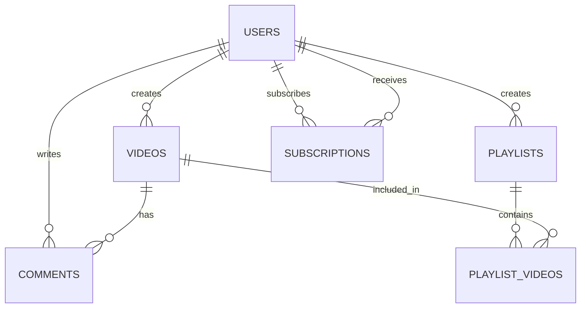

# Database Architecture

VideoCloud uses PostgreSQL as its primary database system. This document outlines the database architecture, schema, and best practices.

## Database Overview

- **DBMS**: PostgreSQL 16
- **ORM**: TypeORM
- **Connection Pool**: Configured for optimal performance
- **Migrations**: Managed through TypeORM migrations

## Database Schema

### Users Table

The users table stores all user-related information:

```sql
CREATE TABLE users (
  id SERIAL PRIMARY KEY,
  email VARCHAR(255) UNIQUE NOT NULL,
  username VARCHAR(255) UNIQUE NOT NULL,
  password VARCHAR(255) NOT NULL,
  isEmailVerified BOOLEAN DEFAULT false,
  avatarUrl VARCHAR(255),
  createdAt TIMESTAMP DEFAULT CURRENT_TIMESTAMP,
  updatedAt TIMESTAMP DEFAULT CURRENT_TIMESTAMP
);
```

### Videos Table

The videos table stores video metadata:

```sql
CREATE TABLE videos (
  id SERIAL PRIMARY KEY,
  title VARCHAR(255) NOT NULL,
  description TEXT,
  userId INTEGER REFERENCES users(id) ON DELETE CASCADE,
  status VARCHAR(50) NOT NULL DEFAULT 'processing',
  url VARCHAR(255),
  thumbnailUrl VARCHAR(255),
  duration INTEGER,
  views INTEGER DEFAULT 0,
  isPublic BOOLEAN DEFAULT true,
  createdAt TIMESTAMP DEFAULT CURRENT_TIMESTAMP,
  updatedAt TIMESTAMP DEFAULT CURRENT_TIMESTAMP
);
```

### Comments Table

The comments table stores user comments on videos:

```sql
CREATE TABLE comments (
  id SERIAL PRIMARY KEY,
  content TEXT NOT NULL,
  userId INTEGER REFERENCES users(id) ON DELETE CASCADE,
  videoId INTEGER REFERENCES videos(id) ON DELETE CASCADE,
  parentId INTEGER REFERENCES comments(id) ON DELETE CASCADE,
  createdAt TIMESTAMP DEFAULT CURRENT_TIMESTAMP,
  updatedAt TIMESTAMP DEFAULT CURRENT_TIMESTAMP
);
```

### Subscriptions Table

The subscriptions table tracks user subscriptions:

```sql
CREATE TABLE subscriptions (
  id SERIAL PRIMARY KEY,
  subscriberId INTEGER REFERENCES users(id) ON DELETE CASCADE,
  creatorId INTEGER REFERENCES users(id) ON DELETE CASCADE,
  createdAt TIMESTAMP DEFAULT CURRENT_TIMESTAMP,
  UNIQUE(subscriberId, creatorId)
);
```

### Playlists Table

The playlists table organizes videos into collections:

```sql
CREATE TABLE playlists (
  id SERIAL PRIMARY KEY,
  title VARCHAR(255) NOT NULL,
  description TEXT,
  userId INTEGER REFERENCES users(id) ON DELETE CASCADE,
  isPublic BOOLEAN DEFAULT true,
  createdAt TIMESTAMP DEFAULT CURRENT_TIMESTAMP,
  updatedAt TIMESTAMP DEFAULT CURRENT_TIMESTAMP
);

CREATE TABLE playlist_videos (
  id SERIAL PRIMARY KEY,
  playlistId INTEGER REFERENCES playlists(id) ON DELETE CASCADE,
  videoId INTEGER REFERENCES videos(id) ON DELETE CASCADE,
  position INTEGER NOT NULL,
  createdAt TIMESTAMP DEFAULT CURRENT_TIMESTAMP,
  UNIQUE(playlistId, videoId)
);
```

## Entity Relationships



## Database Access

VideoCloud uses TypeORM for database access with the following patterns:

### Entities

Database tables are represented as entity classes:

```typescript
@Entity()
export class User {
  @PrimaryGeneratedColumn()
  id: number;

  @Column({ unique: true })
  email: string;

  @Column({ unique: true })
  username: string;

  @Column()
  password: string;

  @Column({ default: false })
  isEmailVerified: boolean;

  @Column({ nullable: true })
  avatarUrl: string;

  @CreateDateColumn()
  createdAt: Date;

  @UpdateDateColumn()
  updatedAt: Date;

  @OneToMany(() => Video, video => video.user)
  videos: Video[];
}
```

### Repositories

TypeORM repositories are used to access and manipulate data:

```typescript
@Injectable()
export class UsersService {
  constructor(
    @InjectRepository(User)
    private usersRepository: Repository<User>,
  ) {}

  async findByEmail(email: string): Promise<User | null> {
    return this.usersRepository.findOne({ where: { email } });
  }

  async create(createUserDto: CreateUserDto): Promise<User> {
    const user = this.usersRepository.create(createUserDto);
    return this.usersRepository.save(user);
  }
}
```

## Migrations

Database migrations are managed through TypeORM:

```typescript
export class CreateInitialTables1617235200000 implements MigrationInterface {
  public async up(queryRunner: QueryRunner): Promise<void> {
    await queryRunner.query(`
      CREATE TABLE users (
        id SERIAL PRIMARY KEY,
        email VARCHAR(255) UNIQUE NOT NULL,
        username VARCHAR(255) UNIQUE NOT NULL,
        password VARCHAR(255) NOT NULL,
        isEmailVerified BOOLEAN DEFAULT false,
        avatarUrl VARCHAR(255),
        createdAt TIMESTAMP DEFAULT CURRENT_TIMESTAMP,
        updatedAt TIMESTAMP DEFAULT CURRENT_TIMESTAMP
      );
    `);
    
    // Additional table creation...
  }

  public async down(queryRunner: QueryRunner): Promise<void> {
    // Rollback logic
  }
}
```

## Database Performance

Several techniques are used to optimize database performance:

1. **Indexing**: Strategic indexes on frequently queried columns
2. **Query Optimization**: Careful design of queries to minimize load
3. **Connection Pooling**: Configured for appropriate connection management
4. **Pagination**: All list endpoints support pagination to limit query size
5. **Selective Loading**: Relations are loaded only when needed

## Related Documentation

- [System Architecture](/docs/architecture/system-architecture)
- [Backend Architecture](/docs/architecture/backend-architecture)
- [API Reference](/docs/api/api-overview) 