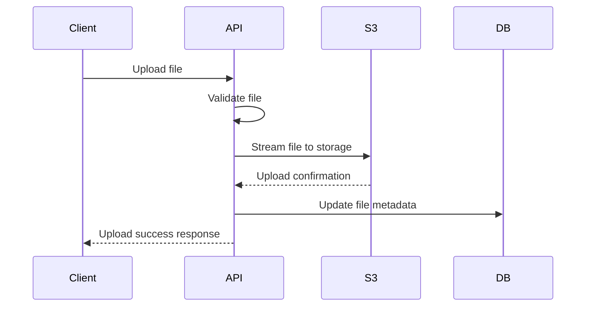
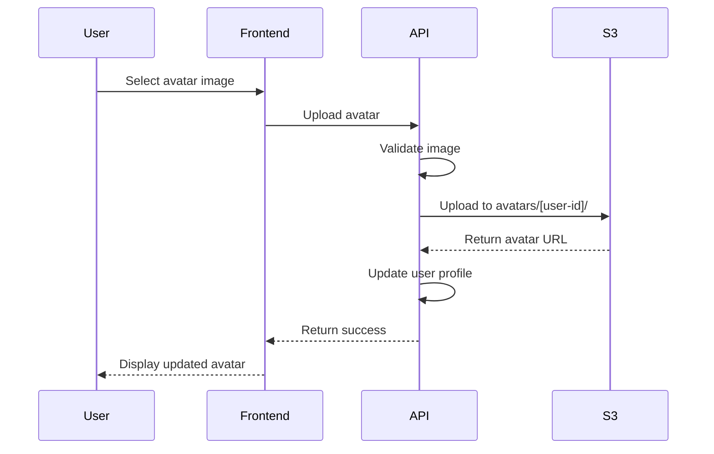
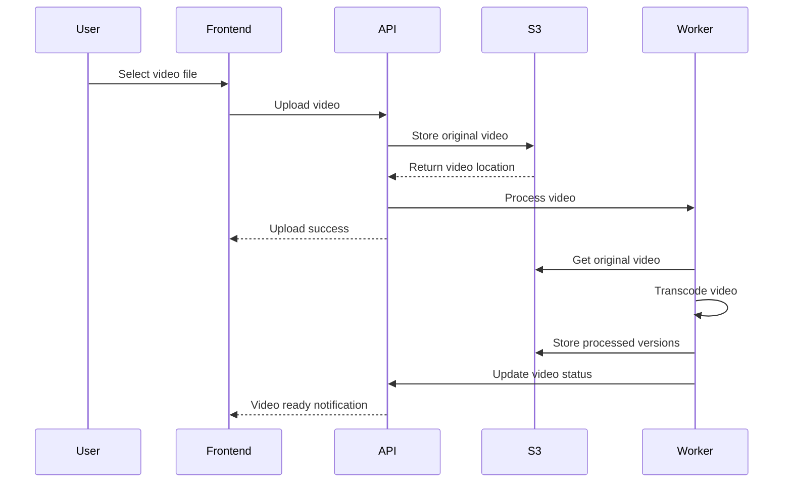

# Storage Architecture

VideoCloud uses a cloud-based object storage architecture to efficiently store and deliver video content and user assets.

## Storage Overview

- **Primary Storage**: S3-compatible object storage (Yandex Cloud Object Storage)
- **File Upload**: Memory-based upload handling (no temporary disk storage)
- **Storage Organization**: Content organized in dedicated buckets and folders
- **Access Control**: Public access for specific content, private access with signed URLs

## Storage Components

### Object Storage

VideoCloud uses Yandex Cloud Object Storage as its primary storage solution, which provides:

- High durability and availability
- Scalable storage capacity
- Content delivery optimization
- Cost-effective storage pricing

### Storage Organization

The storage is organized into the following structure:

```
videocloud-bucket/
├── videos/
│   ├── [user-id]/
│   │   ├── [video-id]/
│   │   │   ├── original.mp4
│   │   │   ├── 1080p.mp4
│   │   │   ├── 720p.mp4
│   │   │   ├── 480p.mp4
│   │   │   └── thumbnail.jpg
│   │   └── ...
│   └── ...
├── avatars/
│   ├── [user-id]/
│   │   └── [filename]
│   └── ...
└── temp/
    └── ... (temporary processing files)
```

## File Upload Implementation

VideoCloud implements a memory-based file upload system:

```typescript
// Backend: File upload interceptor configuration
@Post('upload')
@UseInterceptors(
  FileInterceptor('file', {
    // Note: no storage defined here - uses memory storage
    limits: {
      fileSize: 1024 * 1024 * 100, // 100MB max file size
    },
  }),
)
async uploadFile(@UploadedFile() file: Express.Multer.File) {
  // File is available in memory via file.buffer
  // Process and upload to S3
}
```

### Upload Process

1. Client uploads file to API server
2. File is streamed into memory (no temporary disk storage)
3. File is validated (size, type, etc.)
4. File is streamed directly to S3 storage
5. Database is updated with file metadata



## Avatar System

### Implementation

VideoCloud supports two types of user avatars:

1. **Generated Avatars**: Created automatically using DiceBear API
2. **Custom Avatars**: Uploaded by users

```typescript
// Avatar URL generation for default avatars
export const generateAvatarUrl = (username: string, size = 32): string => {
  return `https://api.dicebear.com/7.x/initials/svg?seed=${encodeURIComponent(username)}&size=${size}`;
};
```

### Avatar Upload Process



## Video Storage

### Video Upload Process



### Video Transcoding

Videos are transcoded into multiple formats for adaptive streaming:

- Original quality (source)
- 1080p (Full HD)
- 720p (HD)
- 480p (SD)
- 360p (Low)

## Content Delivery

### Direct S3 Access

For public content, S3 provides direct access:

```typescript
// Generate public URL for video
export const getPublicVideoUrl = (videoKey: string): string => {
  return `https://storage.yandexcloud.net/${BUCKET_NAME}/${videoKey}`;
};
```

### Signed URLs

For protected content, signed URLs provide temporary access:

```typescript
// Generate signed URL with expiration
async generateSignedUrl(key: string, expiresIn = 3600): Promise<string> {
  const command = new GetObjectCommand({
    Bucket: this.bucket,
    Key: key,
  });
  
  return await getSignedUrl(this.s3Client, command, { expiresIn });
}
```

## Security Considerations

- Access control via signed URLs and direct access permissions
- Content isolation between users
- Bucket policies for additional protection
- CORS configuration for browser access
- File validation before storage

## Related Documentation

- [System Architecture](/docs/architecture/system-architecture)
- [Backend Architecture](/docs/architecture/backend-architecture)
- [API Reference](/docs/api/api-overview) 