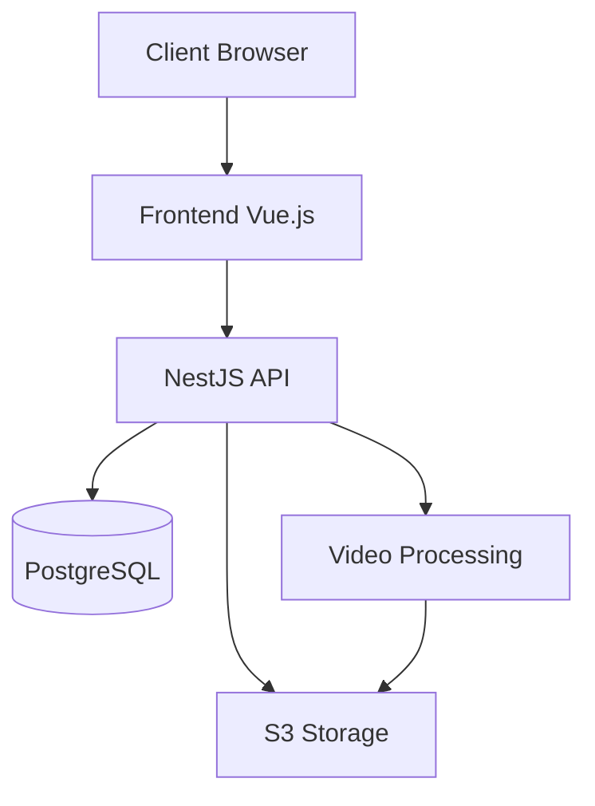
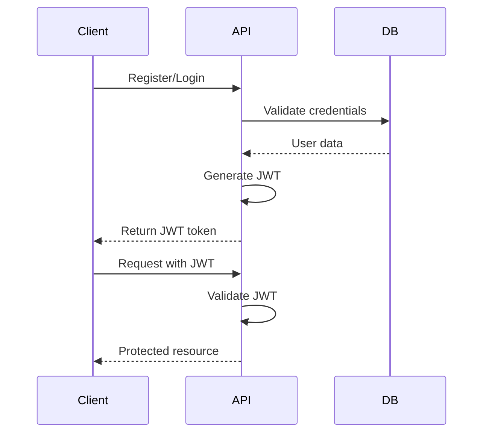
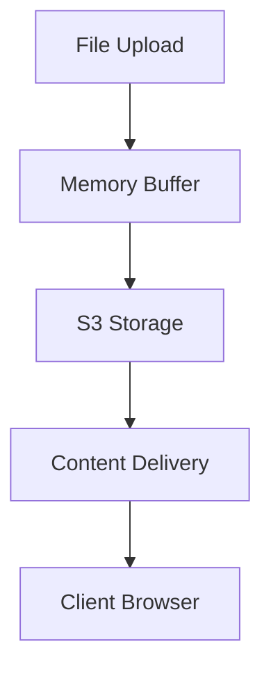
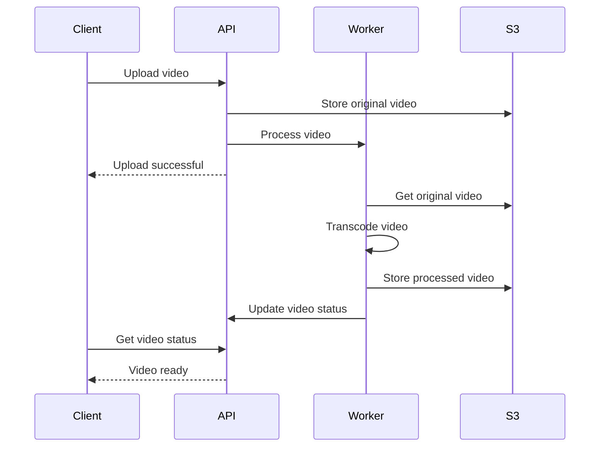
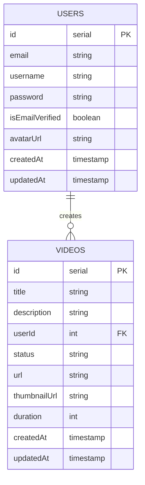

# System Architecture

The VideoCloud platform is designed with scalability, performance, and maintainability in mind. This document provides an overview of the system architecture.

## Architecture Overview



## Technology Stack

### Frontend
- Vue 3 with Composition API
- TypeScript
- CSS Modules for styling
- Vite for build and development
- Feature-Sliced Design methodology
- Pinia for state management
- Vue Router for routing
- Vitest for unit testing
- Playwright for E2E testing

### Backend
- NestJS framework
- TypeScript
- TypeORM for database operations
- PostgreSQL for database
- JWT for authentication
- bcrypt for password hashing
- Multer for file uploads
- AWS SDK for S3 integration (Yandex Cloud)
- fluent-ffmpeg for video processing
- ffprobe for media metadata extraction

### Development Tools
- pnpm for package management
- ESLint for linting
- Prettier for code formatting
- Git for version control
- Docker for containerization

## Component Architecture

### Frontend Components

The frontend follows Feature-Sliced Design methodology with the following layers:

1. **App Layer** - Application entry point and global settings
2. **Features Layer** - Business logic for specific features
   - Auth feature
   - Video management feature
   - User profile feature
3. **Shared Layer** - Reusable components and utilities

```
frontend/
├── src/
│   ├── features/       # Feature modules (auth, videos, etc.)
│   │   ├── auth/
│   │   │   ├── api/    # API requests
│   │   │   ├── ui/     # UI components 
│   │   │   └── model/  # State management
│   │   └── ...
│   ├── shared/         # Shared code
│   │   ├── lib/        # Utilities
│   │   ├── ui/         # Common UI components
│   │   └── api/        # API utilities
│   └── app/            # Application entry point
└── ...
```

### Backend Components

The backend follows a modular architecture with NestJS:

1. **Controllers** - Handle HTTP requests
2. **Services** - Implement business logic
3. **Modules** - Group related functionality
4. **Guards** - Protect routes
5. **Interceptors** - Transform responses

```
backend/
├── src/
│   ├── auth/           # Authentication module
│   │   ├── dto/        # Data transfer objects
│   │   ├── guards/     # Auth guards
│   │   └── strategies/ # Auth strategies
│   ├── users/          # Users module
│   │   ├── dto/        # Data transfer objects
│   │   └── entities/   # Database entities
│   ├── videos/         # Videos module
│   ├── config/         # Configuration
│   ├── shared/         # Shared services
│   │   └── services/
│   │       └── s3.service.ts
│   └── migrations/     # Database migrations
└── ...
```

## Authentication System

- JWT-based authentication
- Secure password hashing with bcrypt
- Token-based session management
- Protected route implementation
- Email verification



## Storage Architecture

VideoCloud uses cloud-based object storage (S3-compatible) for storing videos and avatars:



- Videos are stored in dedicated buckets
- User avatars are stored separately
- Files are streamed directly from memory to S3
- Signed URLs are used for secure access

## Video Processing



- Videos are processed asynchronously
- Multiple quality levels are generated
- Thumbnails are automatically created
- Progress updates via Server-Sent Events (SSE)

## Database Schema

The main entities in the system include:

- Users
- Videos
- Comments
- Playlists
- Subscriptions



## API Endpoints

The API follows RESTful principles and includes endpoints for:

- Authentication
- User management
- Video operations
- Comments and interactions
- Analytics and reporting

## Security Measures

- Secure password hashing
- JWT token validation
- Protected routes
- Input sanitization
- Secure file handling
- CORS configuration
- Environment variable protection

## Related Documentation

- [Frontend Architecture](./frontend-architecture)
- [Backend Architecture](./backend-architecture)
- [Database Architecture](./database-architecture)
- [Storage Architecture](./storage-architecture)
- [API Reference](/docs/api/api-overview) 