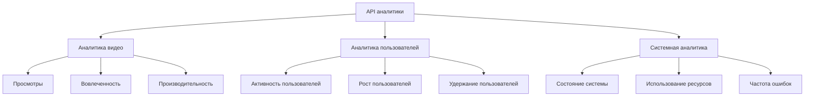

# Справочник API аналитики

API аналитики предоставляет конечные точки для доступа к данным аналитики видео и пользователей, включая просмотры, вовлеченность и показатели производительности.

## Обзор аналитики



## Аналитика видео

### Получение аналитики видео

Получение аналитики для конкретного видео:

```http
GET /analytics/videos/{id}?period=7d&metrics=views,engagement,performance
```

Параметры запроса:

| Параметр | Тип | Описание |
|-----------|------|-------------|
| `period` | строка | Период времени (1d, 7d, 30d, all) |
| `metrics` | строка[] | Метрики для включения |
| `groupBy` | строка | Группировка по (hour, day, week) |
| `compare` | строка | Сравнение с предыдущим периодом |

Ответ:

```json
{
  "success": true,
  "data": {
    "period": {
      "start": "2024-03-24T00:00:00Z",
      "end": "2024-03-31T00:00:00Z",
      "previous": {
        "start": "2024-03-17T00:00:00Z",
        "end": "2024-03-24T00:00:00Z"
      }
    },
    "views": {
      "total": 10000,
      "unique": 8000,
      "change": 0.15,
      "byCountry": {
        "US": 5000,
        "UK": 2000,
        "DE": 1000
      },
      "byDevice": {
        "desktop": 6000,
        "mobile": 4000
      },
      "byPlatform": {
        "web": 7000,
        "ios": 2000,
        "android": 1000
      },
      "timeline": [
        {
          "date": "2024-03-24",
          "views": 1000,
          "unique": 800
        }
      ]
    },
    "engagement": {
      "averageWatchTime": 120,
      "completionRate": 0.75,
      "likes": 500,
      "comments": 100,
      "shares": 50,
      "timeline": [
        {
          "date": "2024-03-24",
          "watchTime": 120000,
          "completionRate": 0.75
        }
      ]
    },
    "performance": {
      "bufferingRate": 0.02,
      "averageBitrate": "2500k",
      "errorRate": 0.001,
      "timeline": [
        {
          "date": "2024-03-24",
          "bufferingRate": 0.02,
          "errorRate": 0.001
        }
      ]
    }
  }
}
```

### Получение сводки аналитики видео

Получение сводной аналитики для нескольких видео:

```http
GET /analytics/videos/summary?period=30d
```

Ответ:

```json
{
  "success": true,
  "data": {
    "totalVideos": 50,
    "totalViews": 100000,
    "totalWatchTime": 12000000,
    "averageEngagement": {
      "watchTime": 120,
      "completionRate": 0.75,
      "likes": 500,
      "comments": 100
    },
    "topVideos": [
      {
        "id": "vid_123456",
        "title": "Лучшее видео",
        "views": 10000,
        "watchTime": 1200000,
        "engagement": 0.8
      }
    ],
    "trends": {
      "views": 0.15,
      "watchTime": 0.2,
      "engagement": 0.1
    }
  }
}
```

## Аналитика пользователей

### Получение аналитики пользователей

Получение аналитики по активности пользователей:

```http
GET /analytics/users?period=30d&metrics=activity,growth,retention
```

Ответ:

```json
{
  "success": true,
  "data": {
    "activity": {
      "activeUsers": {
        "daily": 1000,
        "weekly": 5000,
        "monthly": 20000
      },
      "sessions": {
        "total": 50000,
        "averageDuration": 600,
        "byDevice": {
          "desktop": 30000,
          "mobile": 20000
        }
      },
      "actions": {
        "uploads": 100,
        "comments": 500,
        "likes": 2000,
        "shares": 300
      }
    },
    "growth": {
      "newUsers": 5000,
      "returningUsers": 15000,
      "churnRate": 0.1,
      "bySource": {
        "organic": 3000,
        "referral": 1000,
        "social": 1000
      }
    },
    "retention": {
      "day1": 0.6,
      "day7": 0.4,
      "day30": 0.2,
      "cohorts": [
        {
          "date": "2024-03-01",
          "day1": 0.6,
          "day7": 0.4,
          "day30": 0.2
        }
      ]
    }
  }
}
```

### Получение вовлеченности пользователей

Получение подробных метрик вовлеченности пользователей:

```http
GET /analytics/users/engagement?period=7d
```

Ответ:

```json
{
  "success": true,
  "data": {
    "engagement": {
      "averageSessionDuration": 600,
      "pagesPerSession": 5,
      "bounceRate": 0.3,
      "byUserType": {
        "new": {
          "sessionDuration": 400,
          "pagesPerSession": 3
        },
        "returning": {
          "sessionDuration": 800,
          "pagesPerSession": 7
        }
      }
    },
    "actions": {
      "uploads": {
        "total": 100,
        "perUser": 0.1
      },
      "comments": {
        "total": 500,
        "perUser": 0.5
      },
      "likes": {
        "total": 2000,
        "perUser": 2
      },
      "shares": {
        "total": 300,
        "perUser": 0.3
      }
    },
    "timeline": [
      {
        "date": "2024-03-24",
        "activeUsers": 1000,
        "averageSessionDuration": 600,
        "actions": {
          "uploads": 20,
          "comments": 100,
          "likes": 400,
          "shares": 60
        }
      }
    ]
  }
}
```

## Системная аналитика

### Получение системной аналитики

Получение аналитики состояния системы и использования ресурсов:

```http
GET /analytics/system?period=7d&metrics=health,resources,errors
```

Ответ:

```json
{
  "success": true,
  "data": {
    "health": {
      "uptime": 99.99,
      "apiRequests": {
        "total": 10000000,
        "perSecond": 115,
        "byEndpoint": {
          "/videos": 5000000,
          "/users": 3000000,
          "/analytics": 2000000
        }
      },
      "responseTime": {
        "average": 50,
        "p95": 200,
        "p99": 500
      }
    },
    "resources": {
      "storage": {
        "used": 10737418240,
        "total": 107374182400,
        "growth": 0.1
      },
      "bandwidth": {
        "total": 107374182400,
        "average": 12885502,
        "peak": 21475836
      },
      "cpu": {
        "average": 0.6,
        "peak": 0.9
      },
      "memory": {
        "average": 0.7,
        "peak": 0.95
      }
    },
    "errors": {
      "rate": 0.001,
      "byType": {
        "500": 100,
        "503": 50,
        "404": 1000
      },
      "byEndpoint": {
        "/videos": {
          "rate": 0.0005
        },
        "/users": {
          "rate": 0.0015
        }
      },
      "timeline": [
        {
          "date": "2024-03-24",
          "rate": 0.001,
          "count": 100
        }
      ]
    }
  }
}
```

## Экспорт данных

### Экспорт аналитики видео

Экспорт аналитики видео в CSV:

```http
GET /analytics/videos/{id}/export?format=csv&period=30d
```

### Экспорт аналитики пользователей

Экспорт аналитики пользователей в CSV:

```http
GET /analytics/users/export?format=csv&period=30d
```

## Настройка отчетов

### Создание запланированного отчета

Создание запланированного отчета:

```http
POST /analytics/reports
Content-Type: application/json

{
  "name": "Еженедельный отчет по видео",
  "description": "Еженедельный отчет по производительности видео",
  "type": "video",
  "metrics": ["views", "engagement", "performance"],
  "schedule": {
    "frequency": "weekly",
    "day": "monday",
    "time": "09:00:00",
    "timezone": "UTC"
  },
  "format": "pdf",
  "recipients": [
    {
      "email": "user@example.com",
      "name": "Пользователь"
    }
  ]
}
```

### Получение запланированных отчетов

Получение списка запланированных отчетов:

```http
GET /analytics/reports
```

### Удаление запланированного отчета

Удаление запланированного отчета:

```http
DELETE /analytics/reports/{id}
``` 