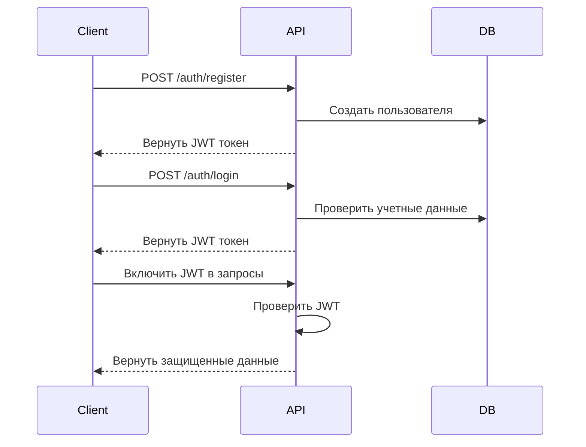

# Руководство по аутентификации

Это руководство охватывает все аспекты аутентификации в API VideoCloud, включая регистрацию пользователей, вход в систему, управление токенами и лучшие практики безопасности.

## Процесс аутентификации



## Регистрация

Регистрация новой учетной записи пользователя:

```http
POST /auth/register
Content-Type: application/json

{
  "email": "user@example.com",
  "password": "secure_password",
  "username": "username",
  "firstName": "John",
  "lastName": "Doe"
}
```

Ответ:

```json
{
  "success": true,
  "data": {
    "token": "eyJhbGciOiJIUzI1NiIs...",
    "user": {
      "id": "usr_123456",
      "email": "user@example.com",
      "username": "username",
      "firstName": "John",
      "lastName": "Doe",
      "createdAt": "2024-03-31T12:00:00Z"
    }
  }
}
```

### Требования к регистрации

- Email должен быть уникальным и действительным
- Пароль должен содержать не менее 8 символов
- Имя пользователя должно содержать 3-30 символов
- Имя пользователя может содержать только буквы, цифры и символы подчеркивания

## Вход в систему

Аутентификация и получение JWT токена:

```http
POST /auth/login
Content-Type: application/json

{
  "email": "user@example.com",
  "password": "secure_password"
}
```

Ответ:

```json
{
  "success": true,
  "data": {
    "token": "eyJhbGciOiJIUzI1NiIs...",
    "user": {
      "id": "usr_123456",
      "email": "user@example.com",
      "username": "username",
      "firstName": "John",
      "lastName": "Doe"
    }
  }
}
```

## Управление токенами

### Структура токена

JWT токены содержат следующие утверждения (claims):

```json
{
  "sub": "usr_123456",
  "email": "user@example.com",
  "role": "user",
  "iat": 1617235200,
  "exp": 1617321600,
  "jti": "jwt_123456"
}
```

### Обновление токена

Обновление истекшего токена:

```http
POST /auth/refresh
Authorization: Bearer <expired_token>
```

Ответ:

```json
{
  "success": true,
  "data": {
    "token": "eyJhbGciOiJIUzI1NiIs...",
    "expiresIn": 86400
  }
}
```

### Аннулирование токена

Выход из системы и аннулирование текущего токена:

```http
POST /auth/logout
Authorization: Bearer <current_token>
```

## Управление паролем

### Забыли пароль

Запрос на сброс пароля:

```http
POST /auth/forgot-password
Content-Type: application/json

{
  "email": "user@example.com"
}
```

### Сброс пароля

Сброс пароля с использованием токена из электронной почты:

```http
POST /auth/reset-password
Content-Type: application/json

{
  "token": "reset_token_from_email",
  "password": "new_secure_password"
}
```

## Интеграция OAuth

VideoCloud поддерживает аутентификацию OAuth 2.0 с популярными провайдерами:

### Google OAuth

```http
GET /auth/google
```

### GitHub OAuth

```http
GET /auth/github
```

### Microsoft OAuth

```http
GET /auth/microsoft
```

## Лучшие практики безопасности

### 1. Безопасность токенов

- Храните токены безопасно (например, в HTTP-only куках)
   - Никогда не раскрывайте токены в клиентском коде
- Реализуйте обновление токена до истечения срока действия
- Используйте токены с коротким сроком действия (по умолчанию: 1 час)

### 2. Безопасность паролей

- Используйте сложные пароли (минимум 8 символов)
   - Реализуйте требования к сложности пароля
- Хешируйте пароли с использованием bcrypt
- Включите двухфакторную аутентификацию

### 3. Безопасность API

- Всегда используйте HTTPS
- Реализуйте ограничение скорости запросов
- Проверяйте все входные данные
- Используйте безопасные заголовки

### 4. Управление сессиями

- Реализуйте правильное время ожидания сессии
- Очищайте сессии при выходе из системы
- Отслеживайте подозрительную активность
- Реализуйте блокировку учетной записи

## Обработка ошибок

Распространенные ошибки аутентификации:

```json
{
  "success": false,
  "error": {
    "code": "AUTH_INVALID_CREDENTIALS",
    "message": "Неверный email или пароль"
  }
}
```

Коды ошибок:

- `AUTH_INVALID_CREDENTIALS`: Неверные учетные данные
- `AUTH_TOKEN_EXPIRED`: Токен истек
- `AUTH_TOKEN_INVALID`: Недействительный токен
- `AUTH_USER_NOT_FOUND`: Пользователь не найден
- `AUTH_EMAIL_EXISTS`: Email уже используется
- `AUTH_USERNAME_EXISTS`: Имя пользователя уже используется

## Примеры кода

### JavaScript (Fetch API)

```javascript
// Вход
async function login(email, password) {
  const response = await fetch('https://api.videocloud.com/auth/login', {
    method: 'POST',
    headers: {
      'Content-Type': 'application/json'
    },
    body: JSON.stringify({ email, password })
  });
  
  const data = await response.json();
  
  if (data.success) {
    localStorage.setItem('token', data.data.token);
    return data.data.user;
  } else {
    throw new Error(data.error.message);
  }
}

// Аутентифицированный запрос
async function fetchUserVideos() {
  const token = localStorage.getItem('token');
  
  if (!token) {
    throw new Error('Не аутентифицирован');
  }
  
  const response = await fetch('https://api.videocloud.com/videos', {
    headers: {
      'Authorization': `Bearer ${token}`
    }
  });
  
  return response.json();
}
```

### Python

```python
import requests

# Вход
def login(email, password):
    response = requests.post(
        'https://api.videocloud.com/auth/login',
        json={'email': email, 'password': password}
    )
    
    data = response.json()
    
    if data['success']:
        return data['data']['token'], data['data']['user']
    else:
        raise Exception(data['error']['message'])

# Аутентифицированный запрос
def fetch_user_videos(token):
    if not token:
        raise Exception('Не аутентифицирован')
    
    response = requests.get(
        'https://api.videocloud.com/videos',
        headers={'Authorization': f'Bearer {token}'}
    )
    
    return response.json()
```

## Связанная документация

- [Обзор API](/docs/api/api-overview)
- [Руководство по безопасности](/docs/security/security-guide)
- [Руководство по интеграции OAuth](/docs/api/oauth-integration) 