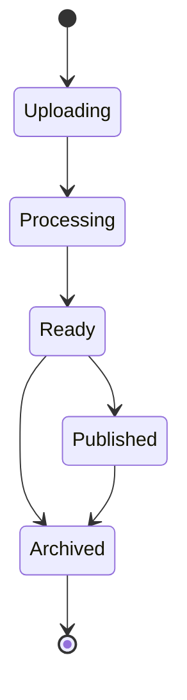

# Справочник API для работы с видео

API для работы с видео предоставляет конечные точки для управления видеоконтентом, включая загрузку, обработку, стриминг и аналитику.

## Жизненный цикл видео



## Управление видео

### Список видео

Получение постраничного списка видео:

```http
GET /videos?page=1&limit=10&sort=createdAt&order=desc
```

Параметры запроса:

| Параметр | Тип | Описание |
|-----------|------|-------------|
| `page` | число | Номер страницы (по умолчанию: 1) |
| `limit` | число | Элементов на странице (по умолчанию: 10, макс: 100) |
| `sort` | строка | Поле сортировки (createdAt, title, views) |
| `order` | строка | Порядок сортировки (asc, desc) |
| `status` | строка | Фильтр по статусу (processing, ready, published) |
| `search` | строка | Поиск в заголовке и описании |

Ответ:

```json
{
  "success": true,
  "data": {
    "items": [
      {
        "id": "vid_123456",
        "title": "Моё видео",
        "description": "Описание видео",
        "status": "published",
        "duration": 120,
        "thumbnailUrl": "https://thumb.videocloud.com/v/123456",
        "views": 1000,
        "createdAt": "2024-03-31T12:00:00Z",
        "publishedAt": "2024-03-31T12:05:00Z"
      }
    ],
    "total": 100,
    "page": 1,
    "limit": 10,
    "pages": 10
  }
}
```

### Получение видео

Получение подробной информации о конкретном видео:

```http
GET /videos/{id}
```

Ответ:

```json
{
  "success": true,
  "data": {
    "id": "vid_123456",
    "title": "Моё видео",
    "description": "Описание видео",
    "status": "published",
    "duration": 120,
    "thumbnailUrl": "https://thumb.videocloud.com/v/123456",
    "streamUrl": "https://stream.videocloud.com/v/123456",
    "downloadUrl": "https://download.videocloud.com/v/123456",
    "views": 1000,
    "likes": 100,
    "comments": 50,
    "tags": ["руководство", "инструкция"],
    "visibility": "public",
    "createdAt": "2024-03-31T12:00:00Z",
    "publishedAt": "2024-03-31T12:05:00Z",
    "metadata": {
      "width": 1920,
      "height": 1080,
      "format": "mp4",
      "codec": "h264",
      "bitrate": "5000k",
      "fps": 30
    }
  }
}
```

### Загрузка видео

Загрузка нового видео:

```http
POST /videos
Content-Type: multipart/form-data

file: <video_file>
title: Моё видео
description: Описание видео
visibility: public
tags: руководство,инструкция
```

Ответ:

```json
{
  "success": true,
  "data": {
    "id": "vid_123456",
    "uploadUrl": "https://upload.videocloud.com/v/123456",
    "status": "uploading",
    "createdAt": "2024-03-31T12:00:00Z"
  }
}
```

### Обновление видео

Обновление информации о видео:

```http
PUT /videos/{id}
Content-Type: application/json

{
  "title": "Обновленный заголовок",
  "description": "Обновленное описание",
  "visibility": "private",
  "tags": ["обновленные", "теги"]
}
```

### Удаление видео

Удаление видео:

```http
DELETE /videos/{id}
```

## Обработка видео

### Статус обработки

Получение статуса обработки видео:

```http
GET /videos/{id}/status
```

Ответ:

```json
{
  "success": true,
  "data": {
    "status": "processing",
    "progress": 75,
    "currentStep": "transcoding",
    "estimatedTimeRemaining": 300,
    "steps": [
      {
        "name": "upload",
        "status": "completed",
        "completedAt": "2024-03-31T12:01:00Z"
      },
      {
        "name": "transcoding",
        "status": "in_progress",
        "progress": 75,
        "startedAt": "2024-03-31T12:01:00Z"
      },
      {
        "name": "thumbnail",
        "status": "pending"
      }
    ]
  }
}
```

### Параметры обработки

Настройка параметров обработки при загрузке:

```http
POST /videos
Content-Type: multipart/form-data

file: <video_file>
title: Моё видео
processing: {
  "quality": "high",
  "formats": ["mp4", "webm"],
  "resolutions": [1080, 720, 480],
  "generateThumbnail": true,
  "watermark": {
    "enabled": true,
    "position": "bottom-right",
    "image": <watermark_file>
  }
}
```

## Стриминг видео

### Получение URL для стриминга

Получение URL для стриминга видео:

```http
GET /videos/{id}/stream
```

Ответ:

```json
{
  "success": true,
  "data": {
    "url": "https://stream.videocloud.com/v/123456",
    "expiresAt": "2024-03-31T13:00:00Z",
    "formats": [
      {
        "quality": "1080p",
        "url": "https://stream.videocloud.com/v/123456/1080p"
      },
      {
        "quality": "720p",
        "url": "https://stream.videocloud.com/v/123456/720p"
      },
      {
        "quality": "480p",
        "url": "https://stream.videocloud.com/v/123456/480p"
      }
    ]
  }
}
```

### Получение URL для загрузки

Получение URL для скачивания видео:

```http
GET /videos/{id}/download
```

Ответ:

```json
{
  "success": true,
  "data": {
    "url": "https://download.videocloud.com/v/123456",
    "expiresAt": "2024-03-31T13:00:00Z",
    "size": 1024000000,
    "formats": [
      {
        "quality": "1080p",
        "url": "https://download.videocloud.com/v/123456/1080p",
        "size": 1024000000
      },
      {
        "quality": "720p",
        "url": "https://download.videocloud.com/v/123456/720p",
        "size": 512000000
      }
    ]
  }
}
```

## Аналитика видео

### Получение статистики просмотров

Получение статистики просмотров видео:

```http
GET /videos/{id}/analytics/views
```

Параметры запроса:

| Параметр | Тип | Описание |
|-----------|------|-------------|
| `start` | строка | Начальная дата (ISO 8601) |
| `end` | строка | Конечная дата (ISO 8601) |
| `interval` | строка | Интервал (hour, day, week, month) |

Ответ:

```json
{
  "success": true,
  "data": {
    "total": 1000,
    "timeWatched": 120000,
    "averageViewDuration": 120,
    "completionRate": 0.85,
    "timeline": [
      {
        "date": "2024-03-30",
        "views": 400
      },
      {
        "date": "2024-03-31",
        "views": 600
      }
    ]
  }
}
```

### Получение статистики вовлеченности

Получение статистики вовлеченности для видео:

```http
GET /videos/{id}/analytics/engagement
```

Ответ:

```json
{
  "success": true,
  "data": {
    "likes": 100,
    "dislikes": 10,
    "comments": 50,
    "shares": 30,
    "watchTime": {
      "total": 120000,
      "average": 120
    },
    "retention": [
      {
        "position": 0,
        "rate": 1.0
      },
      {
        "position": 30,
        "rate": 0.9
      },
      {
        "position": 60,
        "rate": 0.8
      },
      {
        "position": 90,
        "rate": 0.7
      },
      {
        "position": 120,
        "rate": 0.6
      }
    ]
  }
}
``` 