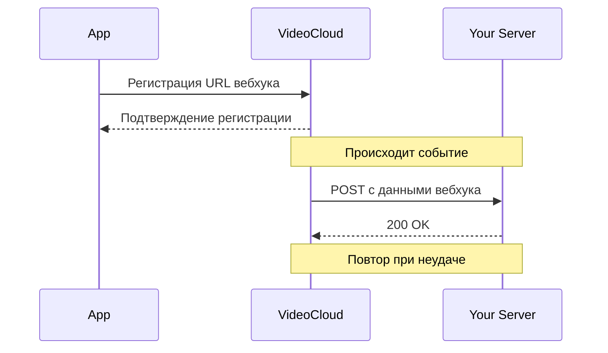

# Руководство по вебхукам

Вебхуки позволяют получать уведомления о событиях в вашей учетной записи VideoCloud в реальном времени. Это руководство объясняет, как настроить и использовать вебхуки.

## Обзор вебхуков



## Настройка вебхуков

### Регистрация вебхука

Регистрация конечной точки вебхука:

```http
POST /webhooks
Content-Type: application/json

{
  "url": "https://your-server.com/webhooks",
  "events": [
    "video.uploaded",
    "video.processed",
    "video.published"
  ],
  "secret": "your_webhook_secret"
}
```

Ответ:

```json
{
  "success": true,
  "data": {
    "id": "whk_123456",
    "url": "https://your-server.com/webhooks",
    "events": [
      "video.uploaded",
      "video.processed",
      "video.published"
    ],
    "status": "active",
    "createdAt": "2024-03-31T12:00:00Z"
  }
}
```

### Список вебхуков

Получение всех зарегистрированных вебхуков:

```http
GET /webhooks
```

Ответ:

```json
{
  "success": true,
  "data": {
    "items": [
      {
        "id": "whk_123456",
        "url": "https://your-server.com/webhooks",
        "events": [
          "video.uploaded",
          "video.processed",
          "video.published"
        ],
        "status": "active",
        "createdAt": "2024-03-31T12:00:00Z",
        "lastDelivery": {
          "success": true,
          "timestamp": "2024-03-31T12:05:00Z"
        }
      }
    ]
  }
}
```

### Обновление вебхука

Обновление конфигурации вебхука:

```http
PUT /webhooks/{id}
Content-Type: application/json

{
  "events": [
    "video.uploaded",
    "video.processed",
    "video.published",
    "video.deleted"
  ],
  "secret": "new_webhook_secret"
}
```

### Удаление вебхука

Удаление вебхука:

```http
DELETE /webhooks/{id}
```

## Типы событий

Вебхуки VideoCloud поддерживают следующие типы событий:

### События видео
- `video.uploaded` - Срабатывает, когда загружается новое видео
- `video.processed` - Срабатывает, когда обработка видео завершена
- `video.published` - Срабатывает, когда видео публикуется
- `video.updated` - Срабатывает, когда обновляются метаданные видео
- `video.deleted` - Срабатывает, когда видео удаляется

### События пользователей
- `user.created` - Срабатывает, когда создается новый пользователь
- `user.updated` - Срабатывает, когда обновляется профиль пользователя
- `user.deleted` - Срабатывает, когда пользователь удаляется

### События взаимодействия
- `engagement.view` - Срабатывает, когда видео просматривается
- `engagement.like` - Срабатывает, когда видео отмечается как понравившееся
- `engagement.comment` - Срабатывает, когда публикуется комментарий

### Системные события
- `system.error` - Срабатывает при возникновении системной ошибки
- `system.warning` - Срабатывает при возникновении системного предупреждения

## Полезная нагрузка вебхуков

### Загрузка видео

```json
{
  "event": "video.uploaded",
  "timestamp": "2024-03-31T12:00:00Z",
  "data": {
    "videoId": "vid_123456",
    "title": "Моё видео",
    "size": 10485760,
    "duration": 120,
    "format": "mp4",
    "userId": "usr_123456",
    "status": "processing"
  }
}
```

### Обработка видео

```json
{
  "event": "video.processed",
  "timestamp": "2024-03-31T12:05:00Z",
  "data": {
    "videoId": "vid_123456",
    "status": "ready",
    "formats": [
      {
        "quality": "1080p",
        "url": "https://stream.videocloud.com/v/123456/1080p",
        "size": 52428800
      },
      {
        "quality": "720p",
        "url": "https://stream.videocloud.com/v/123456/720p",
        "size": 26214400
      }
    ],
    "thumbnailUrl": "https://thumb.videocloud.com/v/123456",
    "processingTime": 300
  }
}
```

### Регистрация пользователя

```json
{
  "event": "user.registered",
  "timestamp": "2024-03-31T12:00:00Z",
  "data": {
    "userId": "usr_123456",
    "email": "user@example.com",
    "username": "username",
    "firstName": "Иван",
    "lastName": "Иванов",
    "registrationMethod": "email"
  }
}
```

### Создание комментария

```json
{
  "event": "comment.created",
  "timestamp": "2024-03-31T12:00:00Z",
  "data": {
    "commentId": "com_123456",
    "videoId": "vid_123456",
    "userId": "usr_123456",
    "content": "Отличное видео!",
    "parentId": null,
    "createdAt": "2024-03-31T12:00:00Z"
  }
}
```

## Безопасность

### Подписи вебхуков

Каждый запрос вебхука включает подпись в заголовке `X-VideoCloud-Signature`. Проверяйте подпись, чтобы убедиться, что запрос пришел от VideoCloud:

```javascript
const crypto = require('crypto');

function verifyWebhookSignature(payload, signature, secret) {
  const hmac = crypto.createHmac('sha256', secret);
  const calculatedSignature = hmac.update(payload).digest('hex');
  return crypto.timingSafeEqual(
    Buffer.from(calculatedSignature, 'hex'),
    Buffer.from(signature, 'hex')
  );
}

// Пример использования в Express.js
app.post('/webhooks', (req, res) => {
  const signature = req.headers['x-videocloud-signature'];
  const payload = JSON.stringify(req.body);
  const secret = 'your_webhook_secret';
  
  if (!verifyWebhookSignature(payload, signature, secret)) {
    return res.status(401).send('Invalid signature');
  }
  
  // Обработка вебхука
  console.log('Received valid webhook:', req.body);
  res.status(200).send('OK');
});
```

### Рекомендации по безопасности

1. **Используйте HTTPS**: Всегда используйте HTTPS для вебхуков, чтобы обеспечить безопасную передачу данных.
2. **Проверяйте подписи**: Всегда проверяйте подписи вебхуков, чтобы убедиться, что запросы легитимны.
3. **Используйте надежные секреты**: Используйте сложные секреты и храните их безопасно.
4. **Быстро отвечайте**: Отправляйте ответ 200 OK как можно быстрее, обрабатывайте данные асинхронно.

## Обработка ошибок и повторные попытки

Если ваш сервер не ответит статусом 2xx, VideoCloud будет повторять попытки по следующему расписанию:

1. Через 1 минуту после первой неудачи
2. Через 5 минут после второй неудачи
3. Через 15 минут после третьей неудачи
4. Через 30 минут после четвертой неудачи
5. Через 1 час после пятой неудачи

После 6 неудачных попыток вебхук помечается как неудачный, и вам нужно будет вручную активировать его снова.

## История доставки вебхуков

Вы можете просмотреть историю доставки вебхуков:

```http
GET /webhooks/{id}/deliveries
```

Ответ:

```json
{
  "success": true,
  "data": {
    "items": [
      {
        "id": "del_123456",
        "event": "video.processed",
        "status": "success",
        "responseCode": 200,
        "timestamp": "2024-03-31T12:05:00Z",
        "retries": 0
      },
      {
        "id": "del_123457",
        "event": "video.published",
        "status": "failed",
        "responseCode": 500,
        "timestamp": "2024-03-31T12:10:00Z",
        "retries": 5,
        "error": "Server responded with 500 status code"
      }
    ],
    "total": 2
  }
}
```

## Тестирование вебхуков

Вы можете отправить тестовый вебхук для проверки конфигурации:

```http
POST /webhooks/{id}/test
Content-Type: application/json

{
  "event": "video.processed"
}
```

Ответ:

```json
{
  "success": true,
  "data": {
    "deliveryId": "del_123458",
    "status": "sent"
  }
}
``` 