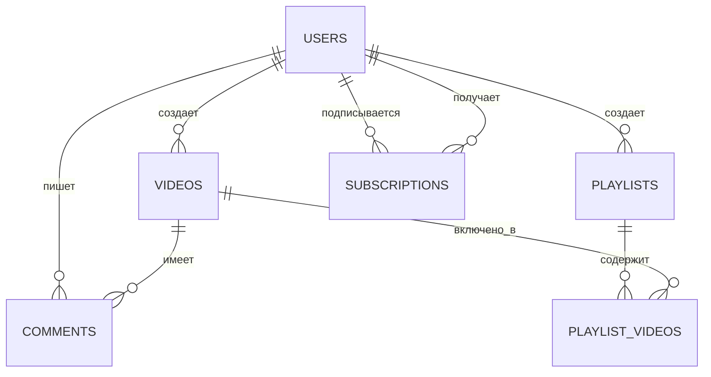

# Архитектура базы данных

VideoCloud использует PostgreSQL в качестве основной системы управления базами данных. В этом документе описывается архитектура базы данных, схема и лучшие практики.

## Обзор базы данных

- **СУБД**: PostgreSQL 16
- **ORM**: TypeORM
- **Пул соединений**: Настроен для оптимальной производительности
- **Миграции**: Управляются через миграции TypeORM

## Схема базы данных

### Таблица Users (Пользователи)

Таблица users хранит всю информацию, связанную с пользователями:

```sql
CREATE TABLE users (
  id SERIAL PRIMARY KEY,
  email VARCHAR(255) UNIQUE NOT NULL,
  username VARCHAR(255) UNIQUE NOT NULL,
  password VARCHAR(255) NOT NULL,
  isEmailVerified BOOLEAN DEFAULT false,
  avatarUrl VARCHAR(255),
  createdAt TIMESTAMP DEFAULT CURRENT_TIMESTAMP,
  updatedAt TIMESTAMP DEFAULT CURRENT_TIMESTAMP
);
```

### Таблица Videos (Видео)

Таблица videos хранит метаданные видео:

```sql
CREATE TABLE videos (
  id SERIAL PRIMARY KEY,
  title VARCHAR(255) NOT NULL,
  description TEXT,
  userId INTEGER REFERENCES users(id) ON DELETE CASCADE,
  status VARCHAR(50) NOT NULL DEFAULT 'processing',
  url VARCHAR(255),
  thumbnailUrl VARCHAR(255),
  duration INTEGER,
  views INTEGER DEFAULT 0,
  isPublic BOOLEAN DEFAULT true,
  createdAt TIMESTAMP DEFAULT CURRENT_TIMESTAMP,
  updatedAt TIMESTAMP DEFAULT CURRENT_TIMESTAMP
);
```

### Таблица Comments (Комментарии)

Таблица comments хранит комментарии пользователей к видео:

```sql
CREATE TABLE comments (
  id SERIAL PRIMARY KEY,
  content TEXT NOT NULL,
  userId INTEGER REFERENCES users(id) ON DELETE CASCADE,
  videoId INTEGER REFERENCES videos(id) ON DELETE CASCADE,
  parentId INTEGER REFERENCES comments(id) ON DELETE CASCADE,
  createdAt TIMESTAMP DEFAULT CURRENT_TIMESTAMP,
  updatedAt TIMESTAMP DEFAULT CURRENT_TIMESTAMP
);
```

### Таблица Subscriptions (Подписки)

Таблица subscriptions отслеживает подписки пользователей:

```sql
CREATE TABLE subscriptions (
  id SERIAL PRIMARY KEY,
  subscriberId INTEGER REFERENCES users(id) ON DELETE CASCADE,
  creatorId INTEGER REFERENCES users(id) ON DELETE CASCADE,
  createdAt TIMESTAMP DEFAULT CURRENT_TIMESTAMP,
  UNIQUE(subscriberId, creatorId)
);
```

### Таблица Playlists (Плейлисты)

Таблица playlists организует видео в коллекции:

```sql
CREATE TABLE playlists (
  id SERIAL PRIMARY KEY,
  title VARCHAR(255) NOT NULL,
  description TEXT,
  userId INTEGER REFERENCES users(id) ON DELETE CASCADE,
  isPublic BOOLEAN DEFAULT true,
  createdAt TIMESTAMP DEFAULT CURRENT_TIMESTAMP,
  updatedAt TIMESTAMP DEFAULT CURRENT_TIMESTAMP
);

CREATE TABLE playlist_videos (
  id SERIAL PRIMARY KEY,
  playlistId INTEGER REFERENCES playlists(id) ON DELETE CASCADE,
  videoId INTEGER REFERENCES videos(id) ON DELETE CASCADE,
  position INTEGER NOT NULL,
  createdAt TIMESTAMP DEFAULT CURRENT_TIMESTAMP,
  UNIQUE(playlistId, videoId)
);
```

## Отношения между сущностями



## Доступ к базе данных

VideoCloud использует TypeORM для доступа к базе данных со следующими паттернами:

### Сущности

Таблицы базы данных представлены как классы сущностей:

```typescript
@Entity()
export class User {
  @PrimaryGeneratedColumn()
  id: number;

  @Column({ unique: true })
  email: string;

  @Column({ unique: true })
  username: string;

  @Column()
  password: string;

  @Column({ default: false })
  isEmailVerified: boolean;

  @Column({ nullable: true })
  avatarUrl: string;

  @CreateDateColumn()
  createdAt: Date;

  @UpdateDateColumn()
  updatedAt: Date;

  @OneToMany(() => Video, video => video.user)
  videos: Video[];
}
```

### Репозитории

Репозитории TypeORM используются для доступа и манипуляции данными:

```typescript
@Injectable()
export class UsersService {
  constructor(
    @InjectRepository(User)
    private usersRepository: Repository<User>,
  ) {}

  async findByEmail(email: string): Promise<User | null> {
    return this.usersRepository.findOne({ where: { email } });
  }

  async create(createUserDto: CreateUserDto): Promise<User> {
    const user = this.usersRepository.create(createUserDto);
    return this.usersRepository.save(user);
  }
}
```

## Миграции

Миграции базы данных управляются через TypeORM:

```typescript
export class CreateInitialTables1617235200000 implements MigrationInterface {
  public async up(queryRunner: QueryRunner): Promise<void> {
    await queryRunner.query(`
      CREATE TABLE users (
        id SERIAL PRIMARY KEY,
        email VARCHAR(255) UNIQUE NOT NULL,
        username VARCHAR(255) UNIQUE NOT NULL,
        password VARCHAR(255) NOT NULL,
        isEmailVerified BOOLEAN DEFAULT false,
        avatarUrl VARCHAR(255),
        createdAt TIMESTAMP DEFAULT CURRENT_TIMESTAMP,
        updatedAt TIMESTAMP DEFAULT CURRENT_TIMESTAMP
      );
    `);
    
    // Создание дополнительных таблиц...
  }

  public async down(queryRunner: QueryRunner): Promise<void> {
    // Логика отката
  }
}
```

## Производительность базы данных

Для оптимизации производительности базы данных используются несколько методов:

1. **Индексирование**: Стратегические индексы на часто запрашиваемых столбцах
2. **Оптимизация запросов**: Тщательное проектирование запросов для минимизации нагрузки
3. **Пулинг соединений**: Настроен для соответствующего управления соединениями
4. **Пагинация**: Все конечные точки списков поддерживают пагинацию для ограничения размера запросов
5. **Выборочная загрузка**: Связи загружаются только при необходимости

## Связанная документация

- [Системная архитектура](/docs/architecture/system-architecture)
- [Архитектура бэкенда](/docs/architecture/backend-architecture)
- [Справочник по API](/docs/api/api-overview) 