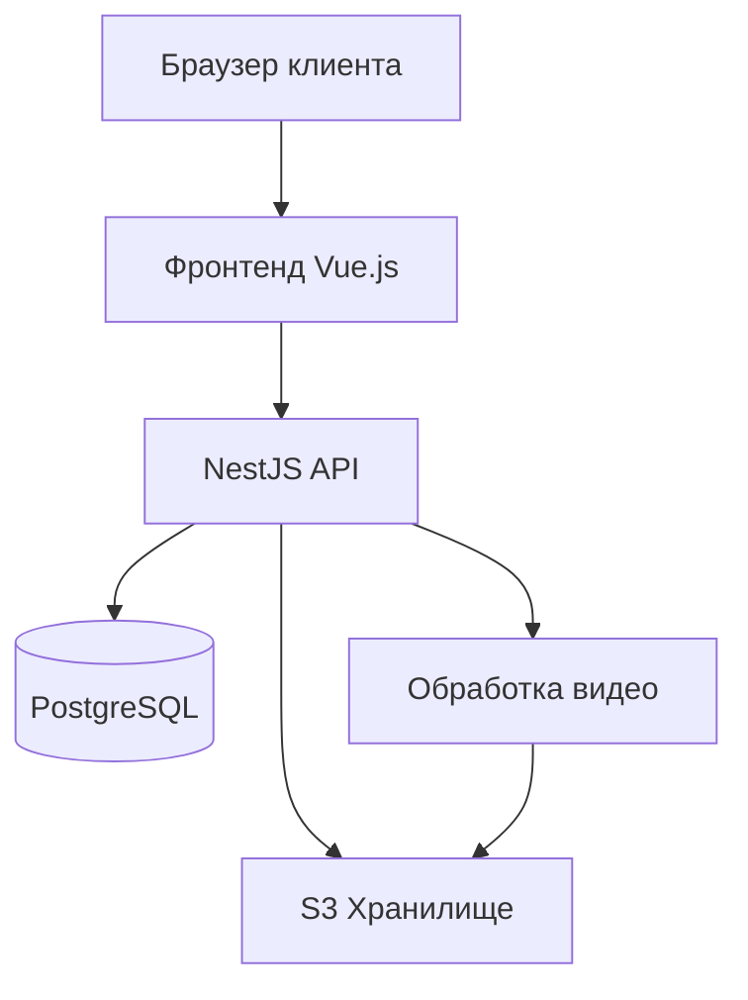
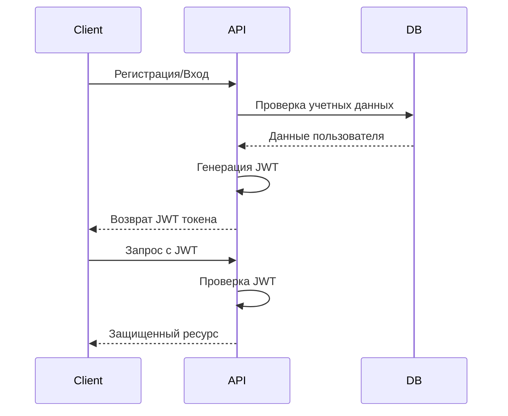
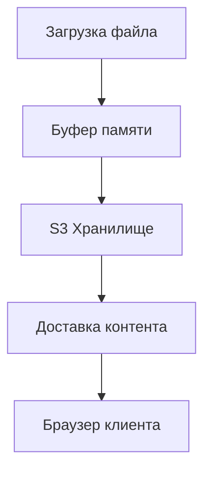
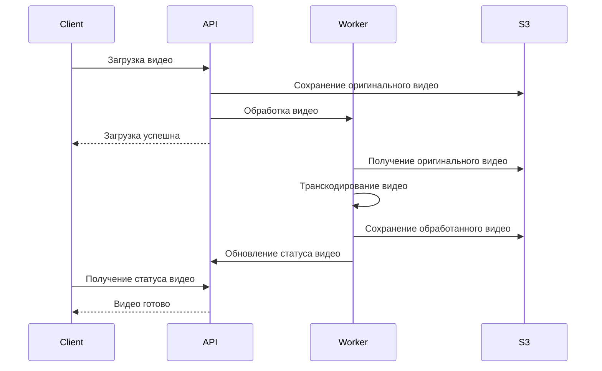
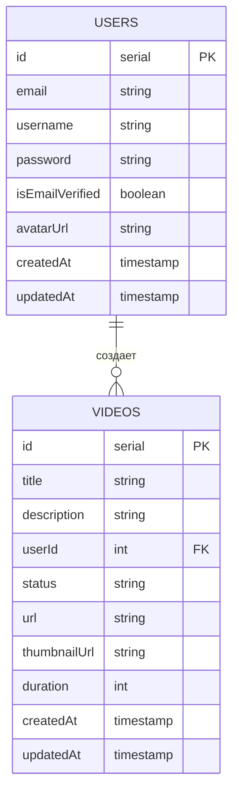

# Системная архитектура

Платформа VideoCloud разработана с учетом масштабируемости, производительности и удобства обслуживания. Этот документ предоставляет обзор архитектуры системы.

## Обзор архитектуры



## Технологический стек

### Фронтенд
- Vue 3 с Composition API
- TypeScript
- CSS Modules для стилизации
- Vite для сборки и разработки
- Feature-Sliced Design методология
- Pinia для управления состоянием
- Vue Router для маршрутизации
- Vitest для модульного тестирования
- Playwright для E2E тестирования

### Бэкенд
- NestJS framework
- TypeScript
- TypeORM для операций с базой данных
- PostgreSQL для базы данных
- JWT для аутентификации
- bcrypt для хеширования паролей
- Multer для загрузки файлов
- AWS SDK для интеграции с S3 (Yandex Cloud)
- fluent-ffmpeg для обработки видео
- ffprobe для извлечения метаданных медиа

### Инструменты разработки
- pnpm для управления пакетами
- ESLint для линтинга
- Prettier для форматирования кода
- Git для контроля версий
- Docker для контейнеризации

## Архитектура компонентов

### Компоненты фронтенда

Фронтенд следует методологии Feature-Sliced Design со следующими слоями:

1. **Слой приложения (App)** - Точка входа в приложение и глобальные настройки
2. **Слой функций (Features)** - Бизнес-логика для конкретных функций
   - Функция аутентификации
   - Функция управления видео
   - Функция профиля пользователя
3. **Общий слой (Shared)** - Многоразовые компоненты и утилиты

```
frontend/
├── src/
│   ├── features/       # Модули функций (auth, videos и т.д.)
│   │   ├── auth/
│   │   │   ├── api/    # API-запросы
│   │   │   ├── ui/     # UI-компоненты 
│   │   │   └── model/  # Управление состоянием
│   │   └── ...
│   ├── shared/         # Общий код
│   │   ├── lib/        # Утилиты
│   │   ├── ui/         # Общие UI-компоненты
│   │   └── api/        # API-утилиты
│   └── app/            # Точка входа приложения
└── ...
```

### Компоненты бэкенда

Бэкенд следует модульной архитектуре с NestJS:

1. **Контроллеры** - Обрабатывают HTTP-запросы
2. **Сервисы** - Реализуют бизнес-логику
3. **Модули** - Группируют связанную функциональность
4. **Guards** - Защищают маршруты
5. **Интерцепторы** - Преобразуют ответы

```
backend/
├── src/
│   ├── auth/           # Модуль аутентификации
│   │   ├── dto/        # Объекты передачи данных
│   │   ├── guards/     # Защита аутентификации
│   │   └── strategies/ # Стратегии аутентификации
│   ├── users/          # Модуль пользователей
│   │   ├── dto/        # Объекты передачи данных
│   │   └── entities/   # Сущности базы данных
│   ├── videos/         # Модуль видео
│   ├── config/         # Конфигурация
│   ├── shared/         # Общие сервисы
│   │   └── services/
│   │       └── s3.service.ts
│   └── migrations/     # Миграции базы данных
└── ...
```

## Система аутентификации

- Аутентификация на основе JWT
- Безопасное хеширование паролей с bcrypt
- Управление сессиями на основе токенов
- Реализация защищенных маршрутов
- Верификация электронной почты



## Архитектура хранилища

VideoCloud использует облачное объектное хранилище (S3-совместимое) для хранения видео и аватаров:



- Видео хранятся в выделенных бакетах
- Аватары пользователей хранятся отдельно
- Файлы передаются напрямую из памяти в S3
- Для безопасного доступа используются подписанные URL

## Обработка видео



- Видео обрабатываются асинхронно
- Генерируются несколько уровней качества
- Миниатюры создаются автоматически
- Обновления прогресса через Server-Sent Events (SSE)

## Схема базы данных

Основные сущности в системе включают:

- Пользователи
- Видео
- Комментарии
- Плейлисты
- Подписки



## Конечные точки API

API следует принципам RESTful и включает конечные точки для:

- Аутентификации
- Управления пользователями
- Операций с видео
- Комментариев и взаимодействий
- Аналитики и отчетности

## Меры безопасности

- Безопасное хеширование паролей
- Проверка токенов JWT
- Защищенные маршруты
- Санитизация ввода
- Безопасная обработка файлов
- Конфигурация CORS
- Защита переменных окружения

## Связанная документация

- [Архитектура фронтенда](./frontend-architecture)
- [Архитектура бэкенда](./backend-architecture)
- [Архитектура базы данных](./database-architecture)
- [Архитектура хранилища](./storage-architecture)
- [Справочник по API](/docs/api/api-overview) 